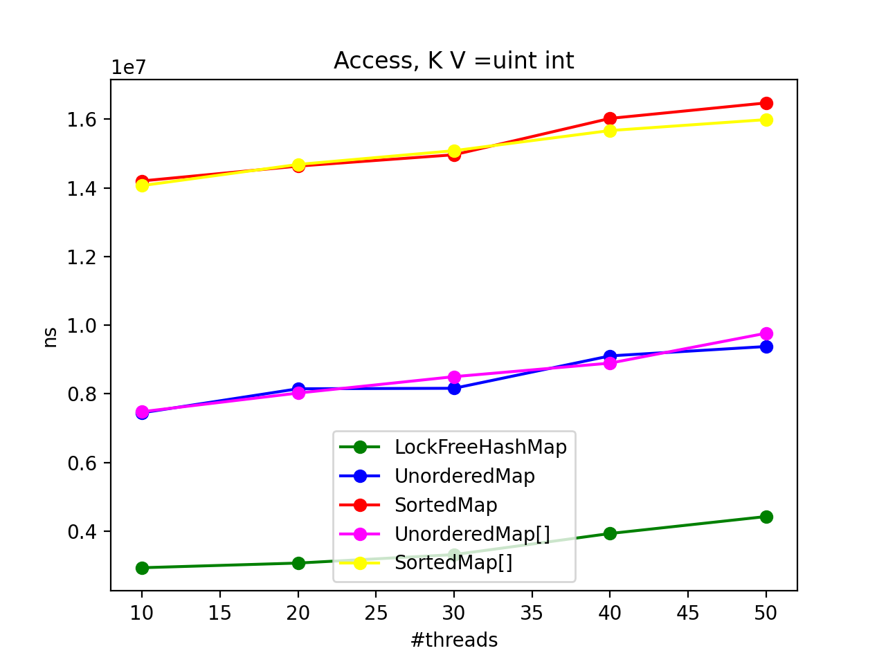

# kpsr-map-benchmarks

# Installation Instructions

## System dependencies

* Ubuntu 14.04 or above
* Cmake 3.5.1 or above
* gcc for C++11 5.4.0 or above.

## Installation

Given `$KLEPSYDRA_HOME`, for example `~/klepsydra`

```bash
cd $KLEPSYDRA_HOME
git clone https://github.com/klepsydra-technologies/kpsr-map-benchmarks
cd kpsr-map-benchmarks
git submodule update --init
mkdir build
cd build
cmake ..
make
sudo make install
```
## Run benchmarks

Benchmarks can be run by the following command:

```bash
cd kpsr-map-benchmarks/build
./bin/map_benchmarks
```

## Overview

Each benchmark measures the cpu impact of *put*, *get* and *erase* method implementations for 3 target classes. The three classes implement different collections: *std::map*, *std::unordered_map* and a custom implementation of a hash table which ensure lock-freeness in *lockfree_hash_table_templated*.

## Method definition
The measured methods are defined as follows:
    * put: the insertion of an element inside a collection.
    * get: the access to an element in a collection.
    * erase: the deletion of an element in a collection.

## Method correspondence for each class
### std::map
It is implemented as a Red-Black tree.
#### put

It corresponds to [std::map::insert](https://en.cppreference.com/w/cpp/container/map/insert).
Complexity is O(log N) in the worst case, where N is the size of the map.

#### get

It corresponds to [std::map::[]](https://en.cppreference.com/w/cpp/container/map/operator_at).
Complexity is O(log N) in the worst case, where N is the size of the map.

It also corresponds to [std::map::at](https://en.cppreference.com/w/cpp/container/map/at), so another comparation is offered using this method.
Complexity is also O(log N) in the worst case, where N is the size of the map.

#### erase

It corresponds to [std::map::erase](https://en.cppreference.com/w/cpp/container/map/erase).
Complexity is amortized O(1). Which means in the general case, the operation takes constant time.

### std::unordered_map

It is implemented as an [open key](https://en.wikipedia.org/wiki/Hash_table#Separate_chaining) hashtable.

#### put

It corresponds to [std::unordered_map::insert](https://en.cppreference.com/w/cpp/container/unordered_map/insert). Complexity is **O(1)**, but when taking into account succesive multiple key collisions, the worst case has O(N) linear.

#### get 

It corresponds to [std::unordered_map::[]](https://en.cppreference.com/w/cpp/container/map/operator_at). Complexity is **O(1)**, but when taking into account succesive multiple key collisions, the worst case has O(N) linear.

It also corresponds to [std::unordered_map::at](https://en.cppreference.com/w/cpp/container/map/at), so another comparation is offered using this method. Complexity is also **O(1)**, but when taking into account succesive multiple key collisions, the worst case has O(N) linear.

#### erase

It corresponds to [std::unordered_map::erase](https://en.cppreference.com/w/cpp/container/unordered_map/erase).
Complexity is also **O(1)**, but when taking into account succesive multiple key collisions, the worst case has O(N) linear.

### LockFreeHashMap

The implementation is similar to *std::unordered_map*, however, *std::unordered_map* lacks the lock-free mechanisms which make threads not get blocked waiting for access the hash table. This property is essential in the core classes of Klepsydra, such as EventLoop. Implementation is located inside modules folder of this project.

#### put

It corresponds to *LockfreeHashTableTemplated::insert*. Complexity is O(1), similar worst case as *std::unordered_map*.

#### get

It corresponds to *LockfreeHashTableTemplated::search*. Complexity is O(1), similar worst case as *std::unordered_map*.

#### erase
It corresponds to *LockfreeHashTableTemplated::remove*. Complexity is O(1), similar worst case as *std::unordered_map*.


# Multithread Results

To better observe the benefits of using *LockFreeHashTable* an extensive benchmarking is done to each of the methods but in the context of multithreaded usage. `std::map` and `std::unordered_map` are not thread-safe, so each operation has been encapsulated in a locked block using a mutex. In all the operations, `N` threads are performing the operation simultaneusly except in operation *insert*, where `1` thread is actually inserting and `N-1` threads are trying to access the collection. `real-time` is the maximum processing time (in nanoseconds) for all the threads.

|    | type             | collection      | operation   |   threads |   real_time |   iterations |
|---:|:-----------------|:----------------|:------------|----------:|------------:|-------------:|
|  0 | std::string, int | LockFreeHashMap | Remove      |        10 | 9.53993e+06 |           70 |
|  1 | std::string, int | LockFreeHashMap | Remove      |        20 | 9.89628e+06 |           69 |
|  2 | std::string, int | LockFreeHashMap | Remove      |        30 | 1.02029e+07 |           65 |
|  3 | std::string, int | LockFreeHashMap | Remove      |        40 | 1.14494e+07 |           60 |
|  4 | std::string, int | LockFreeHashMap | Remove      |        50 | 1.16886e+07 |           62 |
|  5 | std::string, int | SortedMap       | Remove      |        10 | 3.99192e+07 |           18 |
|  6 | std::string, int | SortedMap       | Remove      |        20 | 3.97268e+07 |           17 |
|  7 | std::string, int | SortedMap       | Remove      |        30 | 4.11676e+07 |           18 |
|  8 | std::string, int | SortedMap       | Remove      |        40 | 4.04318e+07 |           17 |
|  9 | std::string, int | SortedMap       | Remove      |        50 | 4.12092e+07 |           17 |
| 10 | std::string, int | UnorderedMap    | Remove      |        10 | 1.5592e+07  |           45 |
| 11 | std::string, int | UnorderedMap    | Remove      |        20 | 1.78234e+07 |           41 |
| 12 | std::string, int | UnorderedMap    | Remove      |        30 | 1.69932e+07 |           43 |
| 13 | std::string, int | UnorderedMap    | Remove      |        40 | 1.77668e+07 |           39 |
| 14 | std::string, int | UnorderedMap    | Remove      |        50 | 1.81524e+07 |           37 |


|    | type             | collection      | operation   |   threads |   real_time |   iterations |
|---:|:-----------------|:----------------|:------------|----------:|------------:|-------------:|
| 15 | std::string, int | LockFreeHashMap | Access      |        10 | 2.93242e+06 |          241 |
| 16 | std::string, int | LockFreeHashMap | Access      |        20 | 3.2329e+06  |          212 |
| 17 | std::string, int | LockFreeHashMap | Access      |        30 | 3.54983e+06 |          205 |
| 18 | std::string, int | LockFreeHashMap | Access      |        40 | 4.36754e+06 |          154 |
| 19 | std::string, int | LockFreeHashMap | Access      |        50 | 4.60979e+06 |          134 |
| 20 | std::string, int | SortedMap       | Access[]    |        10 | 1.79992e+07 |           38 |
| 21 | std::string, int | SortedMap       | Access[]    |        20 | 1.95307e+07 |           36 |
| 22 | std::string, int | SortedMap       | Access[]    |        30 | 2.04057e+07 |           35 |
| 23 | std::string, int | SortedMap       | Access[]    |        40 | 2.08194e+07 |           34 |
| 24 | std::string, int | SortedMap       | Access[]    |        50 | 2.12208e+07 |           32 |
| 25 | std::string, int | SortedMap       | AccessAt    |        10 | 1.86247e+07 |           39 |
| 26 | std::string, int | SortedMap       | AccessAt    |        20 | 1.96876e+07 |           36 |
| 27 | std::string, int | SortedMap       | AccessAt    |        30 | 2.01328e+07 |           35 |
| 28 | std::string, int | SortedMap       | AccessAt    |        40 | 2.13029e+07 |           34 |
| 29 | std::string, int | SortedMap       | AccessAt    |        50 | 2.17402e+07 |           33 |
| 30 | std::string,int  | UnorderedMap    | Access[]    |        10 | 1.03536e+07 |           71 |
| 31 | std::string,int  | UnorderedMap    | Access[]    |        20 | 1.08813e+07 |           65 |
| 32 | std::string,int  | UnorderedMap    | Access[]    |        30 | 1.15881e+07 |           63 |
| 33 | std::string,int  | UnorderedMap    | Access[]    |        40 | 1.18481e+07 |           53 |
| 34 | std::string,int  | UnorderedMap    | Access[]    |        50 | 1.2498e+07  |           57 |
| 35 | std::string, int | UnorderedMap    | AccessAt    |        10 | 1.00721e+07 |           69 |
| 36 | std::string, int | UnorderedMap    | AccessAt    |        20 | 1.07144e+07 |           65 |
| 37 | std::string, int | UnorderedMap    | AccessAt    |        30 | 1.11375e+07 |           64 |
| 38 | std::string, int | UnorderedMap    | AccessAt    |        40 | 1.16426e+07 |           59 |
| 39 | std::string, int | UnorderedMap    | AccessAt    |        50 | 1.21785e+07 |           58 |


|    | type             | collection      | operation   |   threads |   real_time |   iterations |
|---:|:-----------------|:----------------|:------------|----------:|------------:|-------------:|
| 40 | std::string, int | LockFreeHashMap | Insert      |        10 | 3.29519e+06 |          206 |
| 41 | std::string, int | LockFreeHashMap | Insert      |        20 | 3.45387e+06 |          195 |
| 42 | std::string, int | LockFreeHashMap | Insert      |        30 | 3.87059e+06 |          185 |
| 43 | std::string, int | LockFreeHashMap | Insert      |        40 | 4.54012e+06 |          165 |
| 44 | std::string, int | LockFreeHashMap | Insert      |        50 | 5.08817e+06 |          116 |
| 45 | std::string, int | SortedMap       | Insert[]    |        10 | 7.41616e+06 |           93 |
| 46 | std::string, int | SortedMap       | Insert[]    |        20 | 8.26314e+06 |           90 |
| 47 | std::string, int | SortedMap       | Insert[]    |        30 | 8.7174e+06  |           81 |
| 48 | std::string, int | SortedMap       | Insert[]    |        40 | 8.74209e+06 |           81 |
| 49 | std::string, int | SortedMap       | Insert[]    |        50 | 9.02023e+06 |           75 |
| 50 | std::string, int | SortedMap       | Insert      |        10 | 7.68981e+06 |           92 |
| 51 | std::string, int | SortedMap       | Insert      |        20 | 8.09005e+06 |           88 |
| 52 | std::string, int | SortedMap       | Insert      |        30 | 8.21239e+06 |           86 |
| 53 | std::string, int | SortedMap       | Insert      |        40 | 8.36306e+06 |           85 |
| 54 | std::string, int | SortedMap       | Insert      |        50 | 9.8341e+06  |           78 |
| 55 | std::string, int | UnorderedMap    | Insert[]    |        10 | 7.68245e+06 |           91 |
| 56 | std::string, int | UnorderedMap    | Insert[]    |        20 | 8.12053e+06 |           83 |
| 57 | std::string, int | UnorderedMap    | Insert[]    |        30 | 8.46212e+06 |           80 |
| 58 | std::string, int | UnorderedMap    | Insert[]    |        40 | 9.01155e+06 |           79 |
| 59 | std::string, int | UnorderedMap    | Insert[]    |        50 | 1.01267e+07 |           61 |
| 60 | std::string, int | UnorderedMap    | Insert      |        10 | 8.59168e+06 |           79 |
| 61 | std::string, int | UnorderedMap    | Insert      |        20 | 8.85283e+06 |           78 |
| 62 | std::string, int | UnorderedMap    | Insert      |        30 | 8.91415e+06 |           81 |
| 63 | std::string, int | UnorderedMap    | Insert      |        40 | 9.71784e+06 |           77 |
| 64 | std::string, int | UnorderedMap    | Insert      |        50 | 9.85341e+06 |           72 |


|    | type                          | collection      | operation   |   threads |   real_time |   iterations |
|---:|:------------------------------|:----------------|:------------|----------:|------------:|-------------:|
| 65 | std::string, std::vector<int> | LockFreeHashMap | Remove      |        10 | 1.68089e+07 |           38 |
| 66 | std::string, std::vector<int> | LockFreeHashMap | Remove      |        20 | 1.67177e+07 |           40 |
| 67 | std::string, std::vector<int> | LockFreeHashMap | Remove      |        30 | 1.78304e+07 |           38 |
| 68 | std::string, std::vector<int> | LockFreeHashMap | Remove      |        40 | 1.81553e+07 |           38 |
| 69 | std::string, std::vector<int> | LockFreeHashMap | Remove      |        50 | 1.90563e+07 |           37 |
| 70 | std::string, std::vector<int> | SortedMap       | Remove      |        10 | 4.40173e+07 |           16 |
| 71 | std::string, std::vector<int> | SortedMap       | Remove      |        20 | 4.57133e+07 |           15 |
| 72 | std::string, std::vector<int> | SortedMap       | Remove      |        30 | 4.57301e+07 |           15 |
| 73 | std::string, std::vector<int> | SortedMap       | Remove      |        40 | 4.61194e+07 |           15 |
| 74 | std::string, std::vector<int> | SortedMap       | Remove      |        50 | 4.69744e+07 |           15 |
| 75 | std::string, std::vector<int> | UnorderedMap    | Remove      |        10 | 2.09428e+07 |           34 |
| 76 | std::string, std::vector<int> | UnorderedMap    | Remove      |        20 | 2.20824e+07 |           32 |
| 77 | std::string, std::vector<int> | UnorderedMap    | Remove      |        30 | 2.20043e+07 |           32 |
| 78 | std::string, std::vector<int> | UnorderedMap    | Remove      |        40 | 2.48921e+07 |           30 |
| 79 | std::string, std::vector<int> | UnorderedMap    | Remove      |        50 | 2.5379e+07  |           29 |


|     | type                          | collection      | operation   |   threads |   real_time |   iterations |
|----:|:------------------------------|:----------------|:------------|----------:|------------:|-------------:|
|  80 | std::string, std::vector<int> | LockFreeHashMap | Access      |        10 | 2.94776e+06 |          239 |
|  81 | std::string, std::vector<int> | LockFreeHashMap | Access      |        20 | 3.22493e+06 |          214 |
|  82 | std::string, std::vector<int> | LockFreeHashMap | Access      |        30 | 3.58242e+06 |          205 |
|  83 | std::string, std::vector<int> | LockFreeHashMap | Access      |        40 | 4.18642e+06 |          171 |
|  84 | std::string, std::vector<int> | LockFreeHashMap | Access      |        50 | 4.89947e+06 |          138 |
|  85 | std::string, std::vector<int> | SortedMap       | Access[]    |        10 | 2.50338e+07 |           28 |
|  86 | std::string, std::vector<int> | SortedMap       | Access[]    |        20 | 2.60246e+07 |           27 |
|  87 | std::string, std::vector<int> | SortedMap       | Access[]    |        30 | 2.66685e+07 |           28 |
|  88 | std::string, std::vector<int> | SortedMap       | Access[]    |        40 | 2.79993e+07 |           25 |
|  89 | std::string, std::vector<int> | SortedMap       | Access[]    |        50 | 2.86471e+07 |           24 |
|  90 | std::string, std::vector<int> | SortedMap       | AccessAt    |        10 | 2.53024e+07 |           29 |
|  91 | std::string, std::vector<int> | SortedMap       | AccessAt    |        20 | 2.67602e+07 |           27 |
|  92 | std::string, std::vector<int> | SortedMap       | AccessAt    |        30 | 2.74603e+07 |           26 |
|  93 | std::string, std::vector<int> | SortedMap       | AccessAt    |        40 | 2.81518e+07 |           24 |
|  94 | std::string, std::vector<int> | SortedMap       | AccessAt    |        50 | 2.90785e+07 |           25 |
|  95 | std::string, std::vector<int> | UnorderedMap    | Access[]    |        10 | 1.84577e+07 |           39 |
|  96 | std::string, std::vector<int> | UnorderedMap    | Access[]    |        20 | 2.00588e+07 |           34 |
|  97 | std::string, std::vector<int> | UnorderedMap    | Access[]    |        30 | 2.04785e+07 |           32 |
|  98 | std::string, std::vector<int> | UnorderedMap    | Access[]    |        40 | 2.26219e+07 |           31 |
|  99 | std::string, std::vector<int> | UnorderedMap    | Access[]    |        50 | 2.17967e+07 |           29 |
| 100 | std::string, std::vector<int> | UnorderedMap    | AccessAt    |        10 | 1.84501e+07 |           38 |
| 101 | std::string, std::vector<int> | UnorderedMap    | AccessAt    |        20 | 2.00919e+07 |           34 |
| 102 | std::string, std::vector<int> | UnorderedMap    | AccessAt    |        30 | 2.06485e+07 |           33 |
| 103 | std::string, std::vector<int> | UnorderedMap    | AccessAt    |        40 | 2.17198e+07 |           32 |
| 104 | std::string, std::vector<int> | UnorderedMap    | AccessAt    |        50 | 2.21429e+07 |           32 |


|     | type                          | collection      | operation   |   threads |   real_time |   iterations |
|----:|:------------------------------|:----------------|:------------|----------:|------------:|-------------:|
| 105 | std::string, std::vector<int> | LockFreeHashMap | Insert      |        10 | 4.09777e+06 |          175 |
| 106 | std::string, std::vector<int> | LockFreeHashMap | Insert      |        20 | 3.53593e+06 |          199 |
| 107 | std::string, std::vector<int> | LockFreeHashMap | Insert      |        30 | 3.78673e+06 |          190 |
| 108 | std::string, std::vector<int> | LockFreeHashMap | Insert      |        40 | 4.55741e+06 |          160 |
| 109 | std::string, std::vector<int> | LockFreeHashMap | Insert      |        50 | 4.80163e+06 |          139 |
| 110 | std::string, std::vector<int> | SortedMap       | Insert[]    |        10 | 7.95365e+06 |           89 |
| 111 | std::string, std::vector<int> | SortedMap       | Insert[]    |        20 | 8.45952e+06 |           84 |
| 112 | std::string, std::vector<int> | SortedMap       | Insert[]    |        30 | 8.3619e+06  |           82 |
| 113 | std::string, std::vector<int> | SortedMap       | Insert[]    |        40 | 8.97867e+06 |           80 |
| 114 | std::string, std::vector<int> | SortedMap       | Insert[]    |        50 | 9.11732e+06 |           75 |
| 115 | std::string, std::vector<int> | SortedMap       | Insert      |        10 | 8.42339e+06 |           84 |
| 116 | std::string, std::vector<int> | SortedMap       | Insert      |        20 | 8.83494e+06 |           82 |
| 117 | std::string, std::vector<int> | SortedMap       | Insert      |        30 | 8.72084e+06 |           79 |
| 118 | std::string, std::vector<int> | SortedMap       | Insert      |        40 | 8.99979e+06 |           75 |
| 119 | std::string, std::vector<int> | SortedMap       | Insert      |        50 | 9.63964e+06 |           75 |
| 120 | std::string, std::vector<int> | UnorderedMap    | Insert[]    |        10 | 8.06914e+06 |           86 |
| 121 | std::string, std::vector<int> | UnorderedMap    | Insert[]    |        20 | 8.91969e+06 |           81 |
| 122 | std::string, std::vector<int> | UnorderedMap    | Insert[]    |        30 | 9.69068e+06 |           81 |
| 123 | std::string, std::vector<int> | UnorderedMap    | Insert[]    |        40 | 9.5859e+06  |           77 |
| 124 | std::string, std::vector<int> | UnorderedMap    | Insert[]    |        50 | 1.02854e+07 |           69 |
| 125 | std::string, std::vector<int> | UnorderedMap    | Insert      |        10 | 9.42492e+06 |           71 |
| 126 | std::string, std::vector<int> | UnorderedMap    | Insert      |        20 | 9.73738e+06 |           70 |
| 127 | std::string, std::vector<int> | UnorderedMap    | Insert      |        30 | 9.46505e+06 |           75 |
| 128 | std::string, std::vector<int> | UnorderedMap    | Insert      |        40 | 9.91658e+06 |           72 |
| 129 | std::string, std::vector<int> | UnorderedMap    | Insert      |        50 | 1.11904e+07 |           70 |


|     | type              | collection      | operation   |   threads |   real_time |   iterations |
|----:|:------------------|:----------------|:------------|----------:|------------:|-------------:|
| 130 | unsigned int, int | LockFreeHashMap | Remove      |        10 | 6.53155e+06 |           95 |
| 131 | unsigned int, int | LockFreeHashMap | Remove      |        20 | 6.80438e+06 |          108 |
| 132 | unsigned int, int | LockFreeHashMap | Remove      |        30 | 7.38809e+06 |          102 |
| 133 | unsigned int, int | LockFreeHashMap | Remove      |        40 | 7.81707e+06 |           86 |
| 134 | unsigned int, int | LockFreeHashMap | Remove      |        50 | 8.57314e+06 |           88 |
| 135 | unsigned int, int | SortedMap       | Remove      |        10 | 2.69915e+07 |           25 |
| 136 | unsigned int, int | SortedMap       | Remove      |        20 | 2.84518e+07 |           24 |
| 137 | unsigned int, int | SortedMap       | Remove      |        30 | 3.01178e+07 |           24 |
| 138 | unsigned int, int | SortedMap       | Remove      |        40 | 3.00634e+07 |           23 |
| 139 | unsigned int, int | SortedMap       | Remove      |        50 | 3.10801e+07 |           23 |
| 140 | unsigned int, int | UnorderedMap    | Remove      |        10 | 1.04533e+07 |           68 |
| 141 | unsigned int, int | UnorderedMap    | Remove      |        20 | 1.10447e+07 |           63 |
| 142 | unsigned int, int | UnorderedMap    | Remove      |        30 | 1.12287e+07 |           62 |
| 143 | unsigned int, int | UnorderedMap    | Remove      |        40 | 1.23769e+07 |           53 |
| 144 | unsigned int, int | UnorderedMap    | Remove      |        50 | 1.25939e+07 |           52 |


|     | type              | collection      | operation   |   threads |   real_time |   iterations |
|----:|:------------------|:----------------|:------------|----------:|------------:|-------------:|
| 145 | unsigned int, int | LockFreeHashMap | Access      |        10 | 2.93533e+06 |          249 |
| 146 | unsigned int, int | LockFreeHashMap | Access      |        20 | 3.07084e+06 |          226 |
| 147 | unsigned int, int | LockFreeHashMap | Access      |        30 | 3.31727e+06 |          208 |
| 148 | unsigned int, int | LockFreeHashMap | Access      |        40 | 3.93209e+06 |          178 |
| 149 | unsigned int, int | LockFreeHashMap | Access      |        50 | 4.4265e+06  |          159 |
| 150 | unsigned int, int | SortedMap       | Access[]    |        10 | 1.40643e+07 |           52 |
| 151 | unsigned int, int | SortedMap       | Access[]    |        20 | 1.46804e+07 |           47 |
| 152 | unsigned int, int | SortedMap       | Access[]    |        30 | 1.50813e+07 |           45 |
| 153 | unsigned int, int | SortedMap       | Access[]    |        40 | 1.5668e+07  |           45 |
| 154 | unsigned int, int | SortedMap       | Access[]    |        50 | 1.59858e+07 |           44 |
| 155 | unsigned int, int | SortedMap       | AccessAt    |        10 | 1.41998e+07 |           51 |
| 156 | unsigned int, int | SortedMap       | AccessAt    |        20 | 1.46317e+07 |           48 |
| 157 | unsigned int, int | SortedMap       | AccessAt    |        30 | 1.49624e+07 |           47 |
| 158 | unsigned int, int | SortedMap       | AccessAt    |        40 | 1.60218e+07 |           45 |
| 159 | unsigned int, int | SortedMap       | AccessAt    |        50 | 1.64721e+07 |           41 |
| 160 | unsigned int, int | UnorderedMap    | Access[]    |        10 | 7.47917e+06 |           98 |
| 161 | unsigned int, int | UnorderedMap    | Access[]    |        20 | 8.02228e+06 |           89 |
| 162 | unsigned int, int | UnorderedMap    | Access[]    |        30 | 8.49998e+06 |           84 |
| 163 | unsigned int, int | UnorderedMap    | Access[]    |        40 | 8.89454e+06 |           76 |
| 164 | unsigned int, int | UnorderedMap    | Access[]    |        50 | 9.76538e+06 |           64 |
| 165 | unsigned int, int | UnorderedMap    | AccessAt    |        10 | 7.44687e+06 |           97 |
| 166 | unsigned int, int | UnorderedMap    | AccessAt    |        20 | 8.14724e+06 |           89 |
| 167 | unsigned int, int | UnorderedMap    | AccessAt    |        30 | 8.16121e+06 |           84 |
| 168 | unsigned int, int | UnorderedMap    | AccessAt    |        40 | 9.10493e+06 |           83 |
| 169 | unsigned int, int | UnorderedMap    | AccessAt    |        50 | 9.37802e+06 |           69 |



|     | type              | collection      | operation   |   threads |   real_time |   iterations |
|----:|:------------------|:----------------|:------------|----------:|------------:|-------------:|
| 170 | unsigned int, int | LockFreeHashMap | Insert      |        10 | 3.06182e+06 |          232 |
| 171 | unsigned int, int | LockFreeHashMap | Insert      |        20 | 3.22303e+06 |          217 |
| 172 | unsigned int, int | LockFreeHashMap | Insert      |        30 | 3.55091e+06 |          203 |
| 173 | unsigned int, int | LockFreeHashMap | Insert      |        40 | 4.40568e+06 |          161 |
| 174 | unsigned int, int | LockFreeHashMap | Insert      |        50 | 4.89316e+06 |          147 |
| 175 | unsigned int, int | SortedMap       | Insert[]    |        10 | 6.33398e+06 |          111 |
| 176 | unsigned int, int | SortedMap       | Insert[]    |        20 | 6.83156e+06 |          103 |
| 177 | unsigned int, int | SortedMap       | Insert[]    |        30 | 7.04965e+06 |           99 |
| 178 | unsigned int, int | SortedMap       | Insert[]    |        40 | 7.05111e+06 |          100 |
| 179 | unsigned int, int | SortedMap       | Insert[]    |        50 | 7.83918e+06 |           92 |
| 180 | unsigned int, int | SortedMap       | Insert      |        10 | 6.41991e+06 |          115 |
| 181 | unsigned int, int | SortedMap       | Insert      |        20 | 6.67777e+06 |          106 |
| 182 | unsigned int, int | SortedMap       | Insert      |        30 | 6.91427e+06 |          101 |
| 183 | unsigned int, int | SortedMap       | Insert      |        40 | 7.17522e+06 |           97 |
| 184 | unsigned int, int | SortedMap       | Insert      |        50 | 8.00856e+06 |           96 |
| 185 | unsigned int, int | UnorderedMap    | Insert[]    |        10 | 6.24145e+06 |          113 |
| 186 | unsigned int, int | UnorderedMap    | Insert[]    |        20 | 6.77752e+06 |          101 |
| 187 | unsigned int, int | UnorderedMap    | Insert[]    |        30 | 6.88754e+06 |          100 |
| 188 | unsigned int, int | UnorderedMap    | Insert[]    |        40 | 7.42622e+06 |           97 |
| 189 | unsigned int, int | UnorderedMap    | Insert[]    |        50 | 7.87018e+06 |           91 |
| 190 | unsigned int, int | UnorderedMap    | Insert      |        10 | 6.92878e+06 |          101 |
| 191 | unsigned int, int | UnorderedMap    | Insert      |        20 | 7.37974e+06 |           99 |
| 192 | unsigned int, int | UnorderedMap    | Insert      |        30 | 7.45956e+06 |           95 |
| 193 | unsigned int, int | UnorderedMap    | Insert      |        40 | 8.13913e+06 |           90 |
| 194 | unsigned int, int | UnorderedMap    | Insert      |        50 | 8.28568e+06 |           76 |


|     | type                           | collection      | operation   |   threads |   real_time |   iterations |
|----:|:-------------------------------|:----------------|:------------|----------:|------------:|-------------:|
| 195 | unsigned int, std::vector<int> | LockFreeHashMap | Remove      |        10 | 1.32112e+07 |           56 |
| 196 | unsigned int, std::vector<int> | LockFreeHashMap | Remove      |        20 | 1.35107e+07 |           54 |
| 197 | unsigned int, std::vector<int> | LockFreeHashMap | Remove      |        30 | 1.40613e+07 |           50 |
| 198 | unsigned int, std::vector<int> | LockFreeHashMap | Remove      |        40 | 1.50567e+07 |           48 |
| 199 | unsigned int, std::vector<int> | LockFreeHashMap | Remove      |        50 | 1.58e+07    |           47 |
| 200 | unsigned int, std::vector<int> | SortedMap       | Remove      |        10 | 3.17364e+07 |           22 |
| 201 | unsigned int, std::vector<int> | SortedMap       | Remove      |        20 | 3.44891e+07 |           21 |
| 202 | unsigned int, std::vector<int> | SortedMap       | Remove      |        30 | 3.41262e+07 |           20 |
| 203 | unsigned int, std::vector<int> | SortedMap       | Remove      |        40 | 3.47874e+07 |           20 |
| 204 | unsigned int, std::vector<int> | SortedMap       | Remove      |        50 | 3.50737e+07 |           20 |
| 205 | unsigned int, std::vector<int> | UnorderedMap    | Remove      |        10 | 1.5398e+07  |           46 |
| 206 | unsigned int, std::vector<int> | UnorderedMap    | Remove      |        20 | 1.63e+07    |           44 |
| 207 | unsigned int, std::vector<int> | UnorderedMap    | Remove      |        30 | 1.67913e+07 |           40 |
| 208 | unsigned int, std::vector<int> | UnorderedMap    | Remove      |        40 | 1.7086e+07  |           42 |
| 209 | unsigned int, std::vector<int> | UnorderedMap    | Remove      |        50 | 1.76074e+07 |           34 |


|     | type                           | collection      | operation   |   threads |   real_time |   iterations |
|----:|:-------------------------------|:----------------|:------------|----------:|------------:|-------------:|
| 210 | unsigned int, std::vector<int> | LockFreeHashMap | Access      |        10 | 2.82088e+06 |          238 |
| 211 | unsigned int, std::vector<int> | LockFreeHashMap | Access      |        20 | 3.25274e+06 |          225 |
| 212 | unsigned int, std::vector<int> | LockFreeHashMap | Access      |        30 | 3.42678e+06 |          199 |
| 213 | unsigned int, std::vector<int> | LockFreeHashMap | Access      |        40 | 4.04242e+06 |          174 |
| 214 | unsigned int, std::vector<int> | LockFreeHashMap | Access      |        50 | 4.53505e+06 |          153 |
| 215 | unsigned int, std::vector<int> | SortedMap       | Access[]    |        10 | 2.13407e+07 |           33 |
| 216 | unsigned int, std::vector<int> | SortedMap       | Access[]    |        20 | 2.2942e+07  |           32 |
| 217 | unsigned int, std::vector<int> | SortedMap       | Access[]    |        30 | 2.35748e+07 |           29 |
| 218 | unsigned int, std::vector<int> | SortedMap       | Access[]    |        40 | 2.42693e+07 |           29 |
| 219 | unsigned int, std::vector<int> | SortedMap       | Access[]    |        50 | 2.47087e+07 |           29 |
| 220 | unsigned int, std::vector<int> | SortedMap       | AccessAt    |        10 | 2.1403e+07  |           32 |
| 221 | unsigned int, std::vector<int> | SortedMap       | AccessAt    |        20 | 2.35354e+07 |           31 |
| 222 | unsigned int, std::vector<int> | SortedMap       | AccessAt    |        30 | 2.4189e+07  |           29 |
| 223 | unsigned int, std::vector<int> | SortedMap       | AccessAt    |        40 | 2.40756e+07 |           29 |
| 224 | unsigned int, std::vector<int> | SortedMap       | AccessAt    |        50 | 2.45462e+07 |           28 |
| 225 | unsigned int, std::vector<int> | UnorderedMap    | Access[]    |        10 | 1.65098e+07 |           41 |
| 226 | unsigned int, std::vector<int> | UnorderedMap    | Access[]    |        20 | 1.83278e+07 |           38 |
| 227 | unsigned int, std::vector<int> | UnorderedMap    | Access[]    |        30 | 1.90755e+07 |           37 |
| 228 | unsigned int, std::vector<int> | UnorderedMap    | Access[]    |        40 | 1.93885e+07 |           35 |
| 229 | unsigned int, std::vector<int> | UnorderedMap    | Access[]    |        50 | 2.02314e+07 |           35 |
| 230 | unsigned int, std::vector<int> | UnorderedMap    | AccessAt    |        10 | 1.63739e+07 |           42 |
| 231 | unsigned int, std::vector<int> | UnorderedMap    | AccessAt    |        20 | 1.81848e+07 |           39 |
| 232 | unsigned int, std::vector<int> | UnorderedMap    | AccessAt    |        30 | 1.88126e+07 |           37 |
| 233 | unsigned int, std::vector<int> | UnorderedMap    | AccessAt    |        40 | 1.98331e+07 |           36 |
| 234 | unsigned int, std::vector<int> | UnorderedMap    | AccessAt    |        50 | 1.99706e+07 |           35 |


|     | type                           | collection      | operation   |   threads |   real_time |   iterations |
|----:|:-------------------------------|:----------------|:------------|----------:|------------:|-------------:|
| 235 | unsigned int, std::vector<int> | LockFreeHashMap | Insert      |        10 | 3.67924e+06 |          190 |
| 236 | unsigned int, std::vector<int> | LockFreeHashMap | Insert      |        20 | 3.40165e+06 |          209 |
| 237 | unsigned int, std::vector<int> | LockFreeHashMap | Insert      |        30 | 3.63099e+06 |          160 |
| 238 | unsigned int, std::vector<int> | LockFreeHashMap | Insert      |        40 | 4.3204e+06  |          156 |
| 239 | unsigned int, std::vector<int> | LockFreeHashMap | Insert      |        50 | 4.81455e+06 |          149 |
| 240 | unsigned int, std::vector<int> | SortedMap       | Insert[]    |        10 | 6.79959e+06 |          105 |
| 241 | unsigned int, std::vector<int> | SortedMap       | Insert[]    |        20 | 7.13949e+06 |           98 |
| 242 | unsigned int, std::vector<int> | SortedMap       | Insert[]    |        30 | 7.08599e+06 |           97 |
| 243 | unsigned int, std::vector<int> | SortedMap       | Insert[]    |        40 | 7.5254e+06  |           98 |
| 244 | unsigned int, std::vector<int> | SortedMap       | Insert[]    |        50 | 8.62473e+06 |           85 |
| 245 | unsigned int, std::vector<int> | SortedMap       | Insert      |        10 | 7.11942e+06 |           95 |
| 246 | unsigned int, std::vector<int> | SortedMap       | Insert      |        20 | 7.33883e+06 |           96 |
| 247 | unsigned int, std::vector<int> | SortedMap       | Insert      |        30 | 7.37217e+06 |           93 |
| 248 | unsigned int, std::vector<int> | SortedMap       | Insert      |        40 | 7.59743e+06 |           84 |
| 249 | unsigned int, std::vector<int> | SortedMap       | Insert      |        50 | 8.09787e+06 |           87 |
| 250 | unsigned int, std::vector<int> | UnorderedMap    | Insert[]    |        10 | 6.74011e+06 |          105 |
| 251 | unsigned int, std::vector<int> | UnorderedMap    | Insert[]    |        20 | 7.11193e+06 |           98 |
| 252 | unsigned int, std::vector<int> | UnorderedMap    | Insert[]    |        30 | 7.05786e+06 |          102 |
| 253 | unsigned int, std::vector<int> | UnorderedMap    | Insert[]    |        40 | 7.61427e+06 |           95 |
| 254 | unsigned int, std::vector<int> | UnorderedMap    | Insert[]    |        50 | 9.48368e+06 |           80 |
| 255 | unsigned int, std::vector<int> | UnorderedMap    | Insert      |        10 | 7.02651e+06 |          106 |
| 256 | unsigned int, std::vector<int> | UnorderedMap    | Insert      |        20 | 7.42785e+06 |           98 |
| 257 | unsigned int, std::vector<int> | UnorderedMap    | Insert      |        30 | 7.74815e+06 |           97 |
| 258 | unsigned int, std::vector<int> | UnorderedMap    | Insert      |        40 | 7.93936e+06 |           88 |
| 259 | unsigned int, std::vector<int> | UnorderedMap    | Insert      |        50 | 8.62368e+06 |           82 |

